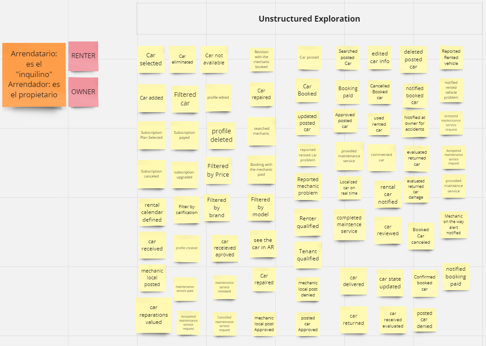
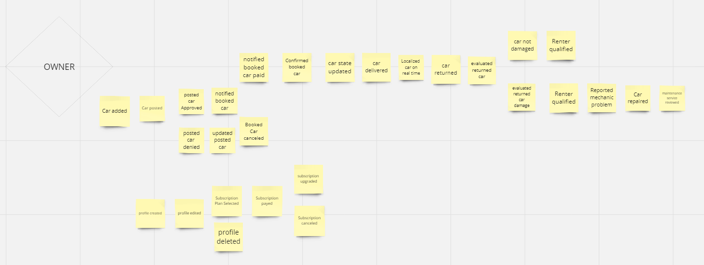

## 4.2 Strategic-Level Domain-Driven Design.
### 4.2.1. EventStorming.
En cuanto al proceso de nuestro EventStorming se utilizó la herramienta MIRO, donde se realizó todo el proceso. Se inició con el primer paso que sería Unstructured Exploration, para ello se analizó y compartieron diferentes opiniones acerca a los eventos del dominio, de igual manera se tuvo en cuenta varios criterios para elegir los eventos de dominio.

Seguido de lo previamente nombrado, se inició el segundo paso llamado Timelines, donde discutimos el flujo de los eventos del dominio para tener una idea mucho más clara.

### 4.2.2. Candidate Context Discovery.

### 4.2.3. Domain Message Flows Modeling.

### 4.2.4. Bounded Context Canvases.

### 4.2.5. Context Mapping.
