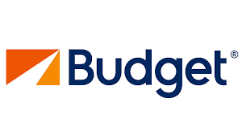
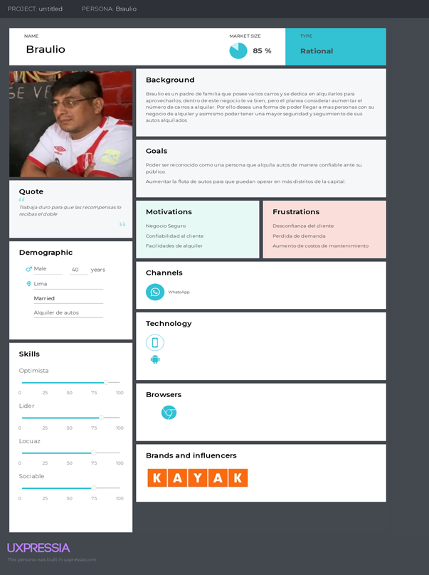
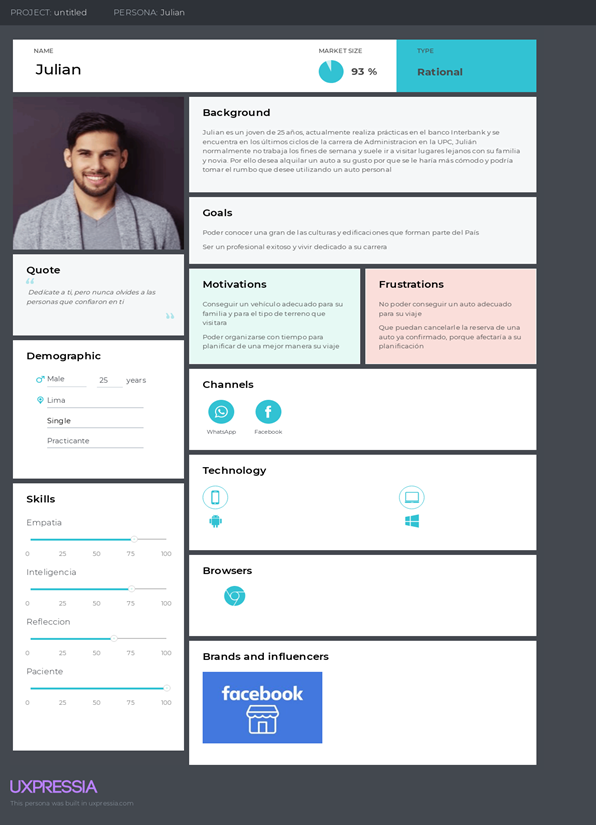
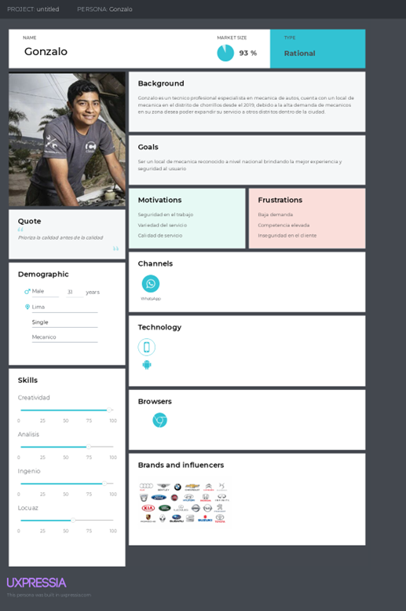
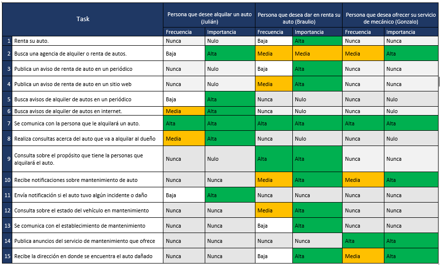

# Capítulo II: Requirements Elicitation & Analysis

## 2.1. Competidores.

En esta sección presentamos algunas compañías dentro de nuestro país que ofrecen servicios similares al nuestro. Las principales empresas competidoras que identificamos son las siguientes:

Momondo 

Momondo es una web app que permite el alquiler de vehículos durante ciertos días que el usuario puede elegir. También esta aplicación web muestra los precios de algunos vehículos disponibles para alquilar. Y el pago es por día. Esta aplicación web posee varias sucursales y se entrega el vehículo en algunas de ellas. 

  

Budgetperu 

Esta empresa de alquiler ofrece un alquiler de vehículo cumpliendo con los protocolos en bioseguridad. Además, esta aplicación web solamente acepta tarjetas de crédito. La entrega y devolución del vehículo es en el aeropuerto Jorge Chávez o alguna de sus sedes de budgetperu. Hay descuentos por temporada. Y tienen carros para diferentes servicios que se acomodan a lo que necesite el usuario. 

  

Kayak 

Esta aplicación web tiene sólo una sede de entrega en Lima. Tiene una sección de mejoras tarifas de los vehículos para los usuarios de Kayak en los últimos meses. Además, muestra los precios de los vehículos disponibles para alquilar y las características de cada vehículo.  

  

### 2.1.1. Análisis competitivo.
### 2.1.2. Estrategias y tácticas frente a competidores.

## 2.2. Entrevistas.
### 2.2.1. Diseño de entrevistas.
**Datos demográficos**  
- ¿Podrías contarnos un poco más de ti? (Historia, quién eres, edad, donde vives, tu trabajo, responsabilidades cotidianas, hobbies, etc.)
- Debe responder lo siguiente, de lo contrario preguntar sobre estos tópicos:
  - Nombre
  - Edad
  - Distrito de residencia
  - Estado civil
  - Familia
  - Ocupación	
- Ahora a manera de dinámica, se mencionarán algunas frases y responde como mejor creas conveniente:
  - Programas de televisión de la infancia
  - Programas de televisión de la actualidad
  - Carro particular o transporte público
  - Android o Apple
  - Lugar de compras de ropa
  - Lugar de compras de abarrotes
  - Lugar de compras de frutas
  - Redes sociales más utilizadas (3)
  - Menciona 2 otras apps que utilices frecuentemente
  - Costo de plan celular
  - Banco preferido

**Personas que son dueños de un auto**  
- ¿En promedio, cuántos días del mes tu auto está siendo alquilado?
- Cuéntame, ¿cuál es el flujo regular si un cliente quiere alquilar tu auto?
- ¿Sueles colocar tu auto en empresas/cocheras para que alquilen tu auto?
- ¿Cuál es el costo de tu auto por día?
- ¿Cómo te aseguras de que el cliente pagará si ocurre daño tu auto?
- ¿Sientes que tu auto está trabajando lo suficiente?
- ¿Cómo crees que podrías ganar más clientes?
- ¿Sientes que el flujo actual para alquilar tu auto es demasiado engorroso? De ser así, ¿cómo crees que podría mejorarse con tecnología?
- ¿Cada cuánto tiempo llevas a mantenimiento tu auto? ¿Cuánto gastas?
- ¿Tienes idea de cuán rentable es este negocio, dada las condiciones actuales, clientela, etc.?
- ¿Cuáles son las 3 redes sociales que más utiliza?
- ¿Qué otras 2 aplicaciones utilizas frecuentemente?
- ¿Utiliza dispositivos Android o Apple?

**Personas que desean alquilar un auto**  
- ¿Cuándo fue la última vez que alquilaste un auto? 
- Cuéntame, ¿Cómo fue el proceso?
- ¿Cómo eliges entre un carro u otro? ¿Con qué características debe contar?
- De todo este proceso, ¿hubo algo que te pareció demasiado engorroso o algo que no te gustó?
- ¿Cómo crees que debería solucionarse este problema?
- Usualmente cuando alquilas un auto, ¿cuál es el motivo?
- ¿Suele acompañarte alguien cuando alquilas un auto?
- ¿Te ha sucedido algún accidente, o te han puesto alguna multa mientras alquilabas un auto? (preguntar por fotomultas de velocidad también)
- ¿Has tenido algún problema con el dueño de un auto, luego de devolverlo? Si:
  - ¿Qué problema fue?
  - ¿Cómo lo resolviste?
- Ahora que todo tiene que ver con internet, ¿te imaginas alguna web app o una app, que te ayude con todo este proceso de alquiler?
- ¿Cómo te imaginas esta web/app?
- ¿Crees que te podría ayudar en algo? 
- ¿Qué característica te gustaría que tuviera?

**Personas que desean alquilar un auto**  
- ¿Cuántos servicios de mecánica de autos realizas al día aproximadamente?
- ¿Qué servicios ofreces en tu taller mecánico?
- ¿Cuál es el servicio más común por el que vienen los clientes?
- ¿Qué tipos de vehículos arreglas?
- ¿Cómo es el proceso para arreglar un vehículo?
- ¿Ha sucedido algún inconveniente con algún cliente?
- ¿Qué problema fue?
- ¿Cómo lo resolviste?
- Ahora que todo tiene que ver con internet, ¿te imaginas alguna web app o una app, que te ayude con todo este proceso de conseguir clientes?
- ¿Cómo te imaginas esta web/app?
- ¿Crees que te podría ayudar en algo? 
- ¿Qué característica te gustaría que tuviera?
- ¿Cuáles son las 3 redes sociales que más utiliza?
- ¿Qué otras 2 aplicaciones utilizas frecuentemente?
- ¿Utiliza dispositivos Android o Apple?
- ¿Qué buscador utiliza con frecuencia?

**Breve Pitch**  
Estamos desarrollando una plataforma web que brindan servicio de alquiler de autos, donde personas que deseen alquilar sus autos puedan publicar anuncios y que, de esta manera, otras personas que deseen alquilarlos los puedan contactar. Atenderemos a tres segmentos objetivos. En primer lugar, personas que poseen un solo auto y deseen ponerlo en alquiler. En segundo lugar, personas que poseen dos o más autos y deseen alquilarlos. Por último, personas que desean rentar un auto. Algunos de nuestros diferenciales como startup son, brindar estadísticas sobre uso, rentabilidad y mantenimiento de los coches puestos en alquiler, variedad de precios que se adaptan al bolsillo de los clientes y variedad de modelos de autos.

**Compromiso**  
¿Qué te ha parecido? ¿Tienes alguna recomendación para nosotros?  
Gracias por habernos concedido esta entrevista, tus respuestas son valiosas para nosotros.  
Como último punto, nos gustaría pedirte una reunión otra vez de aquí a unas cuantas semanas, donde te podremos mostrarte cómo va el desarrollo de nuestra idea, donde podremos mostrarte el prototipo de nuestra aplicación y obtener retroalimentación de ti una vez más.

### 2.2.2. Registro de entrevistas.

#### 2.2.2.1 Entrevistas a arrendadores de autos
##### 2.2.2.1.1. Entrevista a Eduardo Burga Gonzales

| Eduardo Burga Gonzales |
|:-------------:|
| Información |
| Nombres: Eduardo |
| Apellidos: Burga Gonzales |
| Edad: 28 años |
| Distrito de residencia: San Miguel, Lima |
| Duración: 6 minutos 28 segundos |
|  |
| Resumen |
| Eduardo, de 28 años, nos comenta que es dueño de una empresa arrendadora de autos, el proceso que un cliente realiza se basa en un contrato el cuál nos comenta que hace que el cliente deba devolver el auto tal cual se lo entrega y de esta manera asegurar que el cliente pague si sucede un accidente. El entrevistado tiene un estacionamiento propio para guardar sus autos, además comenta que los precios de los autos están entre 150 a 300 nuevos soles. Considera que el proceso no es tan complicado desde su punto de vista. Nos comenta que utiliza aplicaciones como facebook e instagram para publicitar su negocio y que cree que realizando una mejor publicidad de su negocio ganaría más clientes. En cuanto al mantenimiento, el mismo realiza una revisión a los autos cada tres meses y cada seis los lleva a que reciban su mantenimiento respectivo el cuál tiene un costo aproxixmado de 300 nuevos soles por auto. En última instancia nos comenta que tiene preferencia por la plataforma de apple. |

#### 2.2.2.2. Entrevistas a arrendatarios de autos
##### 2.2.2.2.1. Entrevista a Luis Carlos Enrique Rodríguez Gomez

| Luis Carlos Enrique Rodríguez Gomez |
|:-------------:|
| Información |
| Nombres: Luis Carlos Enrique |
| Apellidos: Rodríguez Gomez |
| Edad: 20 años |
| Distrito de residencia: Pueblo Libre, Lima |
| Duración: 3 minutos 11 segundos |
|  |
| Resumen |
| Luis, de 20 años, es un estudiante de 5to año de medicina. En primera instancia nos comenta que la última vez que realizó el alquiler de un auto fue hace un mes aproximadamente y que las razones por las cuales las realiza son comúnmente porque tiene alguna visita, viajes familiares o para alguna ocasión especial con su pareja. Nos comenta que el proceso de alquilar un auto no le parece complejo a pesar de que realice este proceso de manera presencial y no con una aplicación, además comenta que no ha tenido problemas con el dueño de los autos debido a que es un cliente frecuente en dicha empresa. Finalmente, comenta que le gustaría utilizar una aplicación para el proceso de alquilar un auto y que este tenga la posibilidad de realizar un filtrado de autos ya sea por número de asientos o modelos, ya que esto le ahorraría mucho tiempo a la hora de buscar un auto de acuerdo a sus características deseadas |

#### 2.2.2.2 Entrevistas a arrendadores de autos
##### 2.2.2.2.1. Entrevista a 

#### 2.2.2.3 Entrevistas a mecánicos
##### 2.2.2.3.1. Entrevista a Jimmy Espinoza Rodriguez

| Jimmy Espinoza Rodriguez |
|:-------------:|
| Información |
| Nombre: Jimmy|
| Apellidos: Espinoza Rodriguez |
| Edad: 35 años |
| Ocupación: Mecánico|
| Distrito de residencia: Los Olivos, Lima |
| Duración:  |
| Resumen |
|Jimmy Espinoza, mecánico de 35 años con 11 años de experiencia, realiza entre 10 y 15 servicios de mecánica de autos al día en su taller. Ofrece una amplia gama de servicios, siendo el mantenimiento periódico el más común. Trabaja principalmente con autos y camionetas de diversas marcas. Le gustaría una aplicación móvil que facilite la comunicación con los clientes, permitiendo programar citas, enviar fotos y videos para mostrar evidencias de los cambios de repuestos y del estado en que se encontró el repuesto dañado, y recibir actualizaciones sobre el progreso de los trabajos. Utiliza principalmente WhatsApp, Facebook e Instagram, y frecuenta aplicaciones como Netflix y YouTube en su dispositivo Android. Además, utiliza Google como buscador con frecuencia. |

### 2.2.3. Análisis de entrevistas.

## 2.3 Needfinding
###  2.3.1 User Personas
Los User Persona se realizaron con el objetivo de definir los arquetipos que representan de forma ficticia los diferentes tipos de usuarios que pueden interactuar con nuestro servicio. A continuación, procederemos a mostrar los User Persona que pudimos extraer en base a un análisis de las entrevistas realizadas anteriormente.

Segmento: Dueños de autos que desean  alquilar su vehículo temporalmente.

  

Segmento: Personas que alquilan autos

Segmento: Personas que ofrecen servicios de mecánica

###  2.3.2 User Task Matrix
Para elaborar la Matriz de Tareas del Usuario, se tuvieron en cuenta los tres segmentos principales a los que va dirigido nuestro producto.

