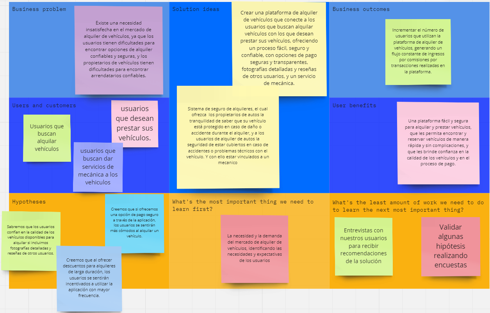

# Capítulo I: Introducción

## 1.1. Startup Profile.
### 1.1.1. Descripción de la Startup.
**Nombre del Startup**  
MotoMingle-Squad es una compañía cuyo principal objetivo es transformar la forma de cómo se alquilan los autos en Perú y elevar la calidad de este servicio.

**Descripción de la Startup**  
MotoMingle-Squad es una empresa que se dedica al desarrollo de software en el sector automovilístico, enfocada en mejorar la manera en cómo se alquilan y rentan autos. Tiene como filosofía el uso de las metodologías ágiles para poder ofrecer los productos y servicios con una mayor calidad y con unos costos y tiempos mucho más reducidos. Además, utilizamos Design Thinking, el cual es un método para generar ideas innovadoras, que se enfoca en la eficacia de entender y dar una solución a los problemas del usuario. Por último, en base a este punto de vista utilizamos el método de trabajo Design sprint que básicamente nos ayuda a solucionar de una manera rápida los diferentes problemas que se nos presentan.

**Visión**  
“Convertirnos en la mejor plataforma de alquiler y renta de vehículos con mayor seguridad del mercado latinoamericano en los próximos tres años.”  
**Misión**  
“Ser el servicio que facilite y agilice la manera de cómo se alquilan y rentan autos más usado del Perú en un año.”

### 1.1.2. Perfiles de integrantes del equipo.
#### Leonardo José Aquino Cruz

+ Soy un estudiante de la universidad peruana de ciencias aplicadas, curso la carrera de Ingeniería de Software, estoy actualmente en el octavo ciclo. Soy una persona perseverante, responsable y creativo. Siempre apoyaré en todo lo que esté a mi alcance a mi equipo.

### 1.2.2 Lean UX Process.

#### 1.2.2.1. Lean UX Problem Statements.
Nuestro servicio ofrece una plataforma para la gestión eficiente del alquiler vehicular, además de un servicio de seguro vehicular tanto paras las personas que alquilan el auto como para las personas que lo rentan, esto con la finalidad de tener un respaldo en caso de tener algún accidente.
Hemos observado que el índice de accidentes vehiculares en lima tiene un porcentaje bastante alto. Por lo que creemos que esto podrías no solo beneficiar a los arrendatarios y arrendadores sino también a los trabajadores de servicio mecánico pues con esto podrías recibir un dinero extra a través de la aplicación ofreciendo sus servicios como asegurador en caso de accidentes vehiculares.
¿Cómo facilitar y agilizar el alquiler y renta de autos para que se realice de una manera sencilla y eficiente?

#### 1.2.2.2. Lean UX Assumptions.
Business Outcomes
-	Consolidarnos como la principal alternativa para el alquiler y seguro de automóviles.
-	Poseer el 70% del mercado de alquiler de automóviles en un año.
-	Deseamos que el 80% de nuestros usuarios posean una membresía de nuestro servicio.

User
-	Nuestros usuarios serán personas que desean alquilar un automóvil y estar asegurado con nuestra aplicación.
-	Nuestros usuarios serán las personas que tienen un automóvil y desean rentarlo para tener un ingreso extra, con la seguridad de tener un seguro contra accidentes por parte de la app.

User Outcomes
¿Quién es el usuario?
Por un lado, personas de entre 30 a 70 años, que poseen uno o más autos y desean ponerlos en alquiler para obtener un ingreso extra. Por otro lado, personas de entre 25 a 70 años que deseen rentar un auto, finalmente un usuario de tipo mecánico el cual desee poder publicar sus servicios por la app.
¿Dónde encaja nuestro producto en sus trabajos o vidas?
Por un lado, para las personas que poseen autos, representa una manera sencilla de publicar y gestionar el alquiler de estos. Por otro lado, para las personas que desean rentar un auto, representa una manera fácil y rápida de alquilar un auto. Finalmente, usuarios de empleo mecánico los cuales deseen poder promocionar sus servicios.
¿Qué problema resuelve nuestro producto?
Permite que cualquier persona que posea uno más autos tenga a su alcance una plataforma en la cual publicar anuncios para su alquiler y, además, poder estar asegurados con un porcentaje del daño realizado al auto en caso de haber algún accidente.
¿Cuándo y cómo es usado nuestro producto?
Nuestro producto será usado cuando las personas deseen poner en alquiler o rentar un auto. Para ello, deberán ingresar a nuestro sitio web y registrarse y pagar la subscripción. 
¿Qué características son importantes?
Algunas características importantes son el diseño responsive, seguridad de la información y uso accesible.
¿Cómo debería verse y comportarse nuestro producto?
El producto debe tener una apariencia que presenta similitud con el negocio, que sea atractivo e intuitivo. El producto debe adaptarse a cualquier tipo de pantalla, cargar el contenido rápido y fácil de manipular.

Features
1. Creo que mis clientes necesitan un servicio donde puedan poner en alquiler o rentar un auto de manera segura.
2. Estas necesidades se pueden resolver con una plataforma confiable que facilite la gestión de autos en alquiler y que permita poder rentar un auto de manera sencilla, además de ofrecer un seguro en caso de accidentes.
3. Mis clientes iniciales son personas que posean autos y desean ponerlos en alquiler y personas que deseen rentar un auto.
4. El valor número uno que un cliente quiere de nuestro servicio es la facilidad y confiabilidad en su uso.
5. El cliente también puede obtener otros beneficios adicionales como, por un lado, datos estadísticos que permitan ver el desempeño de los autos puestos en alquiler y, por otro lado, variedad de marcas, modelos y precios de autos para rentar.
6. Voy a adquirir a la mayoría de mis clientes a través de campañas de marketing por internet.
7. Haré dinero a través de cobro de membresías para el alquiler de autos y seguros contra accidentes.
8. Mi competencia principal en el mercado serán las empresas dedicadas al alquiler de autos.
9. Los venceremos debido a nuestra plataforma web que permite que las personas que alquilen sus autos obtengan datos estadísticos además de la seguridad de poder tener un respaldo en caso de accidentes tanto para el que lo alquila como para que lo adquiere.
10. Mi mayor riesgo con este producto es que las personas no utilicen nuestro servicio para publicar un alquiler o rentar un auto.
11. Resolveremos esto a través del afianzamiento de los clientes mediante promociones y descuentos.

#### 1.2.2.3. Lean UX Hypothesis Statements.
|Descripción|Creemos que, si ofrecemos una opción de pago seguro a través de la aplicación, los usuarios se sentirán más cómodos al alquilar un vehículo.|
|----------------|-------------------------------------------------------------------------------------------------------------------------------------------------------|
|Métrica|Incremento del 20% en el número de usuarios que utilizan la función de pago en la aplicación.|

|Descripción|Creemos que, al ofrecer descuentos para alquileres de larga duración, los usuarios se sentirán incentivados a utilizar la aplicación con mayor frecuencia.|
|----------------|-------------------------------------------------------------------------------------------------------------------------------------------------------|
|Métrica|Incremento del 15% en el número de usuarios que alquilan vehículos por un periodo mayor a 7 días.|

|Descripción|Sabremos que los usuarios confían en la calidad de los vehículos disponibles para alquilar si incluimos fotografías detalladas y reseñas de otros usuarios.|
|----------------|-------------------------------------------------------------------------------------------------------------------------------------------------------|
|Métrica|Incremento del 10% en el número de usuarios que alquilan un vehículo basado en fotografías y reseñas.|
 
|Descripción|Creemos que, si agregamos un sistema de calificación para los arrendatarios y arrendadores, los usuarios se sentirán más cómodos al alquilar y prestar sus vehículos.|
|----------------|-------------------------------------------------------------------------------------------------------------------------------------------------------|
|Métrica|Incremento del 15% en el número de usuarios que alquilan o prestan vehículos a través de la aplicación.|

|Descripción|Creemos que, si ofrecemos un servicio de mecánica de emergencia a través de la aplicación, los usuarios estarán más dispuestos a alquilar un vehículo.|
|----------------|-------------------------------------------------------------------------------------------------------------------------------------------------------|
|Métrica|Incremento del 10% en el número de usuarios que alquilan un vehículo.|

|Descripción|Sabremos que los usuarios están satisfechos con el proceso de alquiler si les solicitamos una calificación y reseña después de cada alquiler.|
|----------------|-------------------------------------------------------------------------------------------------------------------------------------------------------|
|Métrica|Incremento del 10% en el número de calificaciones y reseñas realizadas por los usuarios después de cada alquiler.|

|Descripción|Creemos que, si ofrecemos una opción para cancelar la reserva sin cargo dentro de un plazo de 24 horas, los usuarios estarán más dispuestos a reservar a través de la aplicación.|
|----------------|-------------------------------------------------------------------------------------------------------------------------------------------------------|
|Métrica|Incremento del 15% en el número de reservas realizadas a través de la aplicación.|

#### 1.2.2.4. Lean UX Canvas.

## 1.3. Segmentos objetivo.
Para la segmentación de nuestro público objetivo que desea alquilar un auto hemos seleccionado a personas de entre 18 a 70 años y que posean carnet de conducción, que suelan utilizar internet frecuentemente. Estas personas deberán presentar de manera virtual algún documento de identidad (DNI, pasaporte o carné de extranjería), licencia de conducir vigente y tarjeta de crédito para garantizar la renta.

Y para la segmentación del público interesado en la renta de su(s) vehículo(s), hemos escogido a personas que cumplan con la mayoría de edad. Estas personas tendrán que cumplir con requisitos como: ITV vigente, vehículo en buen estado, tener la documentación necesaria, matrícula aprobada y por último que sea una persona física o empresa la que autoriza el alquiler.

Y para la última segmentación del publico interesada en ofrecer sus servicios de mecánica, hemos escogido a mecánicas que tengan todos sus papeles en regla. Estas mecánicas tendrán que cumplir como requisitos como: inscrita como empresa, licencia de actividades y pago de impuestos.

En la segmentación de mercado usamos las siguientes variables:

Geográficas:  
Por ahora, nuestro startup solo estará disponible en Perú, próximamente agregaremos más países latinoamericanos.

Demográficas:  
La información que necesitamos conocer es que superan la mayoría de edad y también debemos conocer la ocupación del usuario.

Psicográficas:  
Los usuarios deben estar buscando comodidad y seguridad al momento de transportarse por las calles de Lima.
