# Capítulo VI: Solution UX Design.
## 6.1. Style Guidelines.
### 6.1.1. General Style Guidelines.
Con conocimientos previos de cursos anteriores, se determina estilos fundamentales para la implementación de las responsive web interfaces:
-	Branding: Se presenta el logo de nuestro producto:

 	 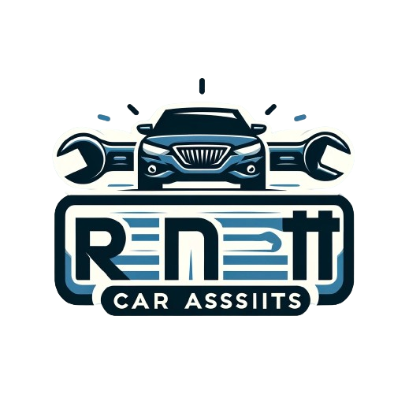

  -	Colors: Como se mencionó en la sección de Branding, decidimos utilizar principalmente el color Azul. A continuación, se mostrará la combinación de colores con sus respectivos códigos.
  
   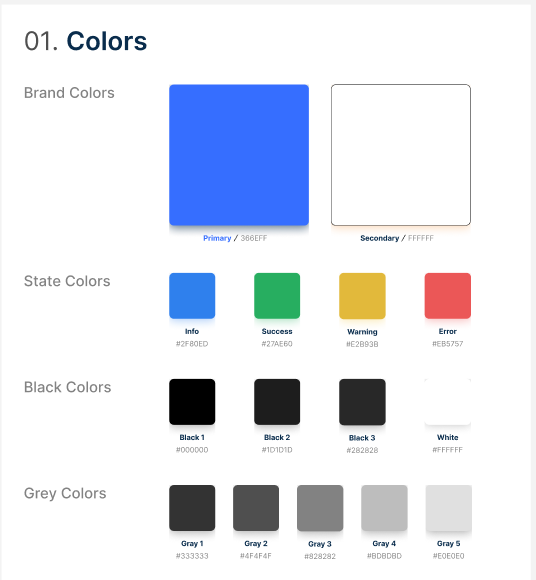

### 6.1.2. Web, Mobile & Devices Style Guidelines.

- Paleta de Colores: En este apartado se muestra la guía de la paleta de colores, tantos primarios, secundarios y grises.
  
- Colores Primarios: Optamos por escoger el color azul ya que es señal de confianza, seguridad y etc. A continuación, se mostrará el color principal.

   

-	Typography:

   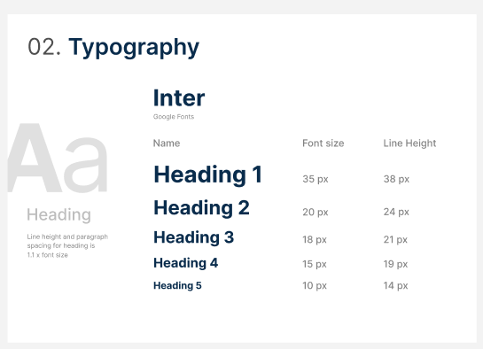

- Spacing:
  
   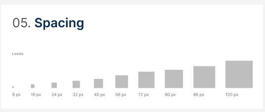

## 6.2. Information Architecture.
### 6.2.2. Labeling Systems.
### 6.2.3. Searching Systems.
### 6.2.4. SEO Tags and Meta Tags.
### 6.2.5. Navigation Systems.
## 6.3. Landing Page UI Design.
### 6.3.1. Landing Page Wireframe.
El wireframe de la página de destino es una representación esquemática que sirve como la columna vertebral del diseño visual y la funcionalidad de la página. En esta sección, detallamos el proceso de creación del wireframe, enfocándonos en la estructuración del contenido, la navegación intuitiva y la optimización de la experiencia del usuario. Los wireframes son fundamentales para asegurar que todos los elementos esenciales estén bien posicionados antes de avanzar a la etapa de diseño más detallado, permitiendo ajustes fáciles y proporcionando una clara visualización de la distribución de los componentes de la página.

  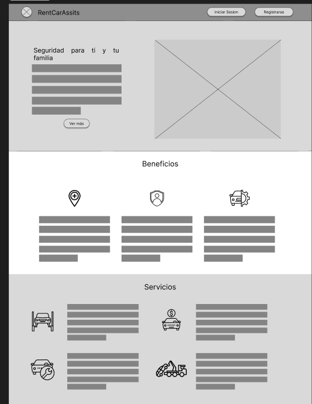
  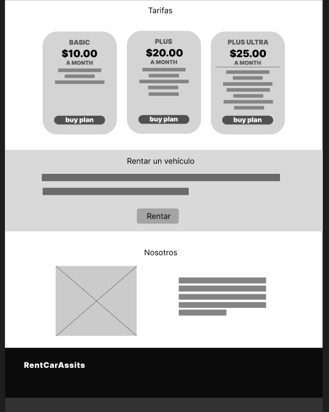
  
  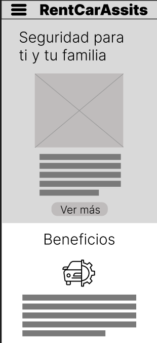
  
  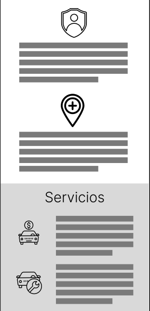
  
  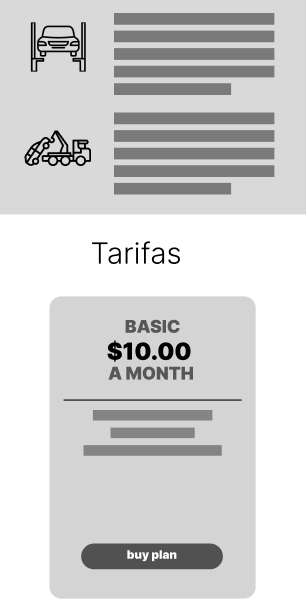
  
  
  
  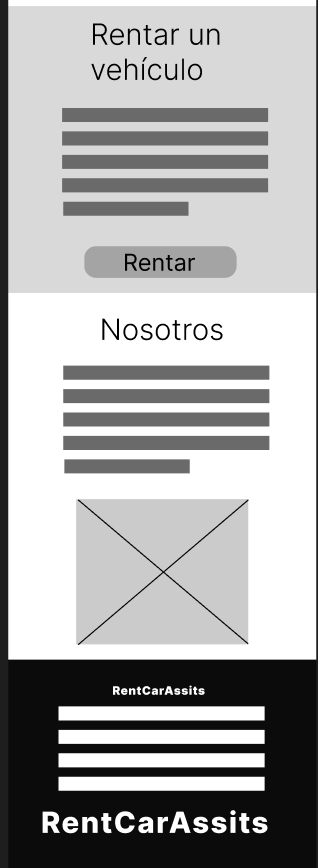
  
### 6.3.2. Landing Page Mock-up.
Tras establecer un wireframe sólido, el siguiente paso es transformarlo en un mock-up más detallado de la página de destino. Esta sección cubre el proceso de diseño del mock-up, donde aplicamos colores, tipografías y otros elementos visuales que reflejan la identidad de la marca. El mock-up es crucial para visualizar el resultado final del diseño web antes de la implementación técnica, permitiendo una revisión exhaustiva y la oportunidad de realizar mejoras estéticas y funcionales antes del desarrollo final.
 
  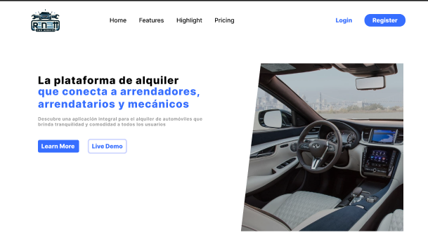
  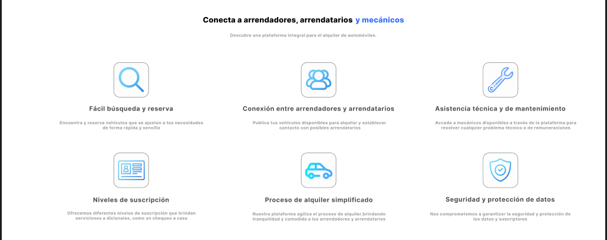
  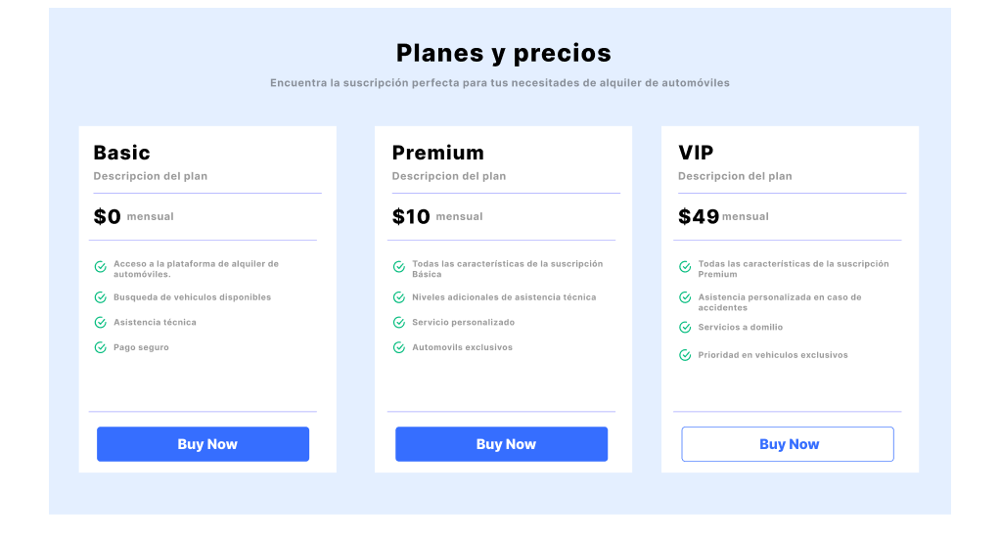

## 6.4. Applications UX/UI Design.
### 6.4.1. Applications Wireframes.
En esta sección, presentamos los Wireframes de la Aplicación (Applications Wireframes) para nuestra plataforma de alquiler de automóviles. Los wireframes son esquemas visuales que representan la estructura y el diseño básico de las diferentes pantallas y elementos de la aplicación. Estos esquemas simplificados permiten a los desarrolladores y diseñadores centrarse en la disposición y funcionalidad de los componentes, antes de abordar los detalles estéticos y de diseño.  
Los Wireframes de la Aplicación ayudan a identificar y planificar las características clave de la plataforma, como la búsqueda y reserva de vehículos, la publicación de vehículos por parte de los arrendadores y la asistencia técnica y de mantenimiento proporcionada por los mecánicos. Al visualizar la disposición y estructura de las pantallas, los wireframes facilitan la comunicación entre los miembros del equipo y los interesados, asegurando que todos tengan una comprensión clara de los objetivos y requisitos de la aplicación.  
A continuación, se muestran los Wireframes de la Aplicación para cada una de las áreas clave de nuestra plataforma de alquiler de automóviles. Estos wireframes servirán como punto de partida para el proceso de diseño y desarrollo, ayudando a garantizar una implementación coherente y efectiva de nuestra solución de alquiler de vehículos.

#### 6.4.1.1. Applications Wireframes (Web).

**Sección de inicio de sesión y registro en página de bienvenida**  
En esta sección el usuario está en la pagina de bienvenida y puede iniciar sesión desde la página, si no tiene ninguna cuenta, puede registrarse desde esa sección.

**Sección de registro de usuarios**  
En esta sección podrá el usuario iniciar sesión y registrarse.

**Sección de alquilar un automóvil**  
En esta sección, el usuario podrá alquilar un automóvil, además de filtrar la busqueda a su gusto. También podrá calificar el vehículo o dejar un comentario.

**Publicación de automóvil**  
En esta sección el usuario podrá publicar sus automóviles, pero no antes de pagar la suscripción.

**Sección mis rentas**  
En esta sección el usuario podrá visualizar sus autos que se encuentran en rentas.

**Sección mis reservas**  
En esta sección el usuario podrá visualizar sus autos que se encuentran en reserva, donde podrá editar sus documentos o eliminar mientras se está en espera.

**Sección de mis mantenimientos**  
En esta sección el usuario tiene la posibilidad de gestionar los mantenimientos realizados en los vehículos de RentCarAssist y de prestar sus servicios.

**Sección de estadísticas**
En esta sección el usuario podrá visualizar las estadísticas de los ingresos y usos de la renta de su auto.

#### 6.4.1.2. Applications Wireframes (Mobile).

- Login views
Las vistas de login servirán para que el usuario logre iniciar sesión con su cuenta previamente creada en la aplicación.

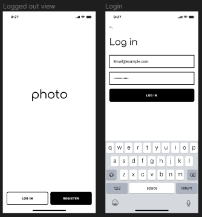

- Register views
Las vistas de register son para que el usuario logre crear una de las tres diferentes tipos de cuenta dentro de nuestra aplicación las cuales son: mecánico, owner o dueño de vehiculos y renter o persona que busca autos.

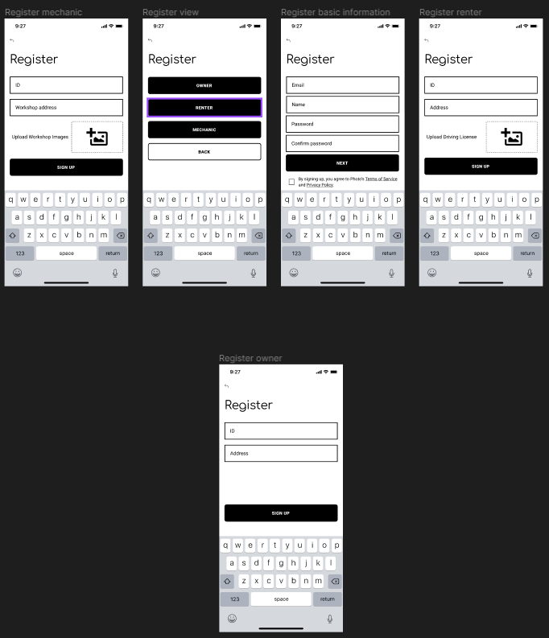

- Home and favorites views
Las vista princial es lo primero que visualizará el usuario al iniciar sesión en la aplicación y la vista de favoritos muestra los vehiculos agregados como favoritos.

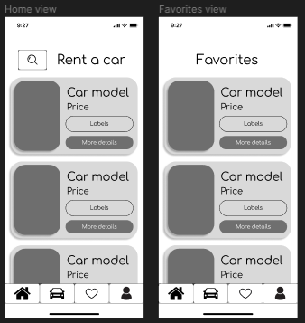

- Search views
La vista para que el renter busque vehiculos para alquilar entro de la aplicación.

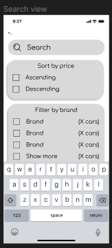

- My bookings and rate up views
La vista de mis reservaciones sirven para que el renter visualice los vehiculos ya alquilados y logre darle una calificación de acuerdo a su criterio.

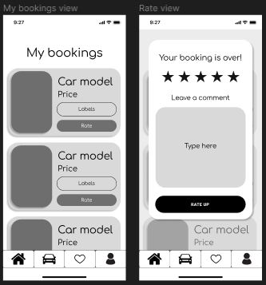

- Car details views
La vista de detalle de vehiculos para que el renter pueda obtener más información acerca del vehiculo y saber si le conviene realizar su alquiler

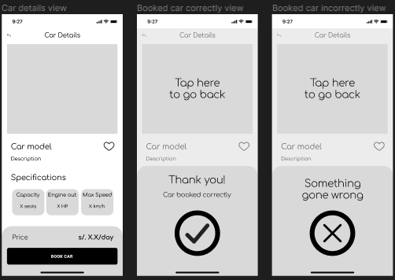
  
- My cars views
Es la vista que visualiza el owner o dueño de vehiculos para que logre editar los vehiculos actualmente publicados dentro de la aplicación

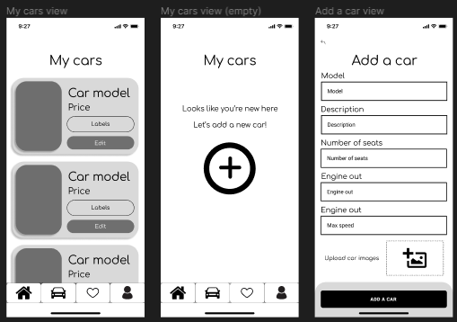

- Profile views
Vista de la información del perfil creado dentro de la aplicación

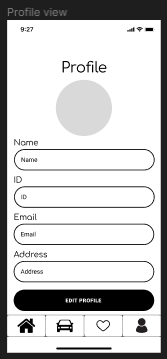

### 6.4.2. Applications Wireflow Diagrams.
#### 6.4.2.1. Applications Wireflow (Web).
#### 6.4.2.2. Applications Wireflow (Mobile).
En cuanto a las wireflow o flujos de la aplicación en dispositivos móviles se tuvieron en cuenta las más principales las cuales son addCar o agregar un vehiculo a la palicación, rentCar o alquilar un carro desde la aplicación y rateUp o calificar un servicio dentro de la aplicación, a continuación presentamos los flujos:

- Add Car
El flujo de agregar un vehículo como dueño de vehículos inicia en la vista de login donde el usuario o se registra como dueño de vehículos o inicia sesión directamente, seguido de ello pasa a la vista princial y deberá presionar el botón de vehículo el cual lo llevará al apartado de mis vehiculos y en caso este no posea un vehiculo le aparecerá un botón al medio para agregar uno y deberá llenar los campos solicitados para su publicación en la aplicación.

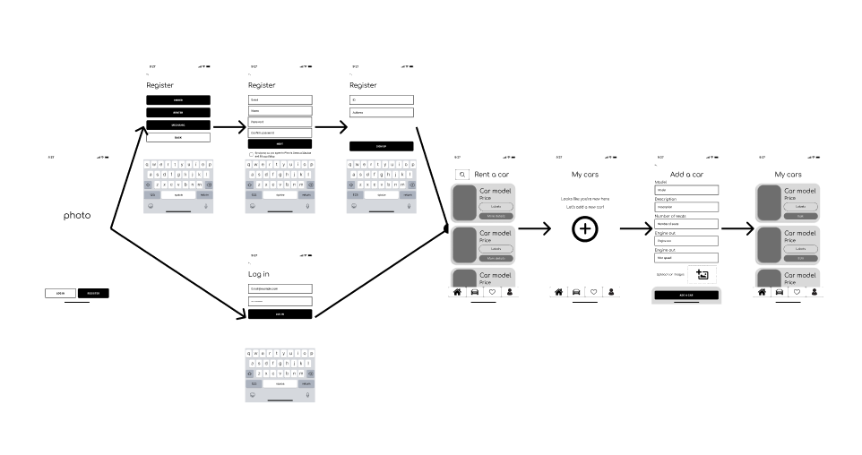

- Rent Car
Para realizar la acción de alquilar un vehículo se necesita una cuenta de renter o persona que busca alquilar un vehículo, el flujo inicia en la vista de login donde el usuario o se registra como un renter o inicia sesión directamente, seguido pasa a la vista principal y deberá presionar la lupa para iniciar la búsqueda de un vehículo, identificar uno que sea de su preferencia y presionar más detalles, esto mostrará los detalles del vehículo y si es de su gusto podrá alquilarlo con el botón inferior dentro de los detalles de vehículo.

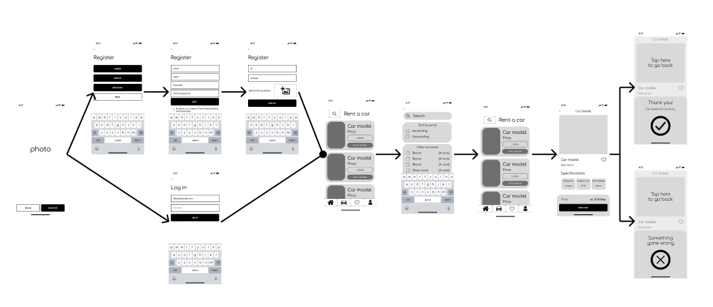

- Rate Up
Para realizar la calificación de un vehículo se deberá haber reservado un vehículo y que haya terminado su reservación. El flujo inicia en la vista de login donde el usuario o se registra como un renter o inicia sesión directamente, seguido pasa a la vista principal y deberá presionar el botón de vehículo donde le mostrará las reservaciones realizadas y deberá presionar el botón de rate up o calificar donde se mostrará un cuadro donde tendrá la posibilidad de poner estrellas y dejar un comentario si lo desea.

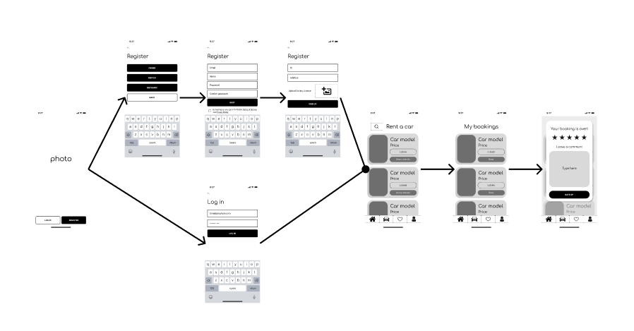

